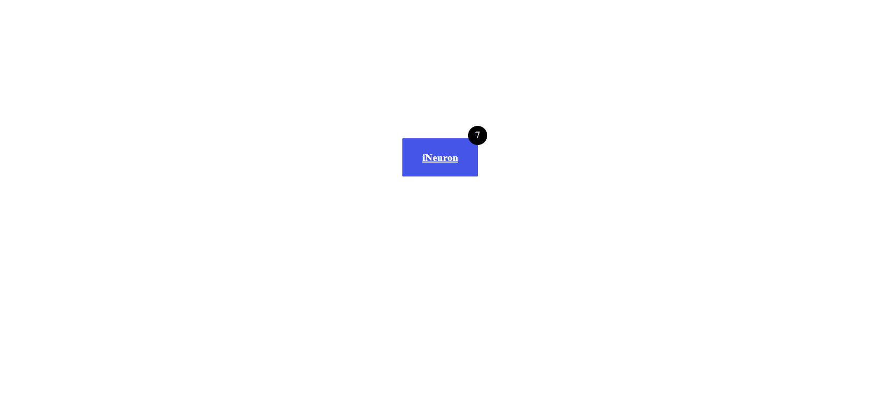

# Button challenge 1 #
[project-live](https://buttonchallenge1.netlify.app)
  - - - -
 # Technology used in this project #
     
    - - - -
* Skill Gained in this project
  * Learned to create buttons using __padding, border, border-radius and bg-clor__
  * Learned to change the position of buttons using __absolute, relative, etc__ 
   - - - -
 ## Time taken to complete this project ##
 *  2hrs to completed this poject
 
 ## Screenshot ##
 
 
 
